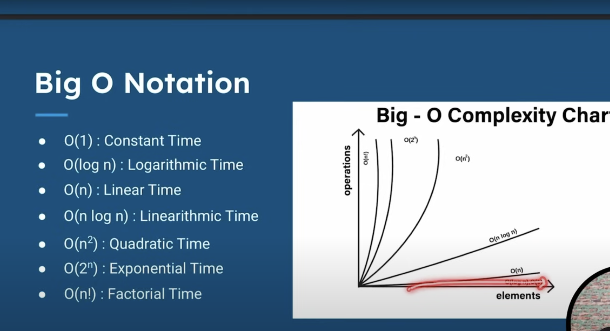

https://www.youtube.com/watch?v=xWLxhF3b5P8&t=3757s

https://github.com/xinw3/leetcode-coding-challenge


# data-structures-in-java
data-structures-in-java


# Algorithms in Java

This repository contains implementations of various algorithms in Java.

## Categories

### Sorting Algorithms
- Bubble Sort
- Selection Sort
- Insertion Sort
- Merge Sort
- Quick Sort
- Heap Sort
- Bucket Sort
- Radix Sort
- Counting Sort

### Searching Algorithms
- Linear Search
- Binary Search
- Interpolation Search
- Exponential Search
- Ternary Search

### Graph Algorithms
- Breadth-First Search (BFS)
- Depth-First Search (DFS)
- Dijkstra's Algorithm
- Bellman-Ford Algorithm
- Floyd-Warshall Algorithm
- Prim's Algorithm
- Kruskal's Algorithm
- Topological Sort

### Dynamic Programming
- Fibonacci Series
- Knapsack Problem
- Longest Common Subsequence
- Matrix Chain Multiplication
- Edit Distance
- Coin Change Problem

### Greedy Algorithms
- Activity Selection Problem
- Huffman Coding
- Fractional Knapsack
- Dijkstra’s Algorithm (can also be classified as greedy)

### Backtracking Algorithms
- N-Queens Problem
- Sudoku Solver
- Hamiltonian Cycle
- Subset Sum

### String Matching Algorithms
- Knuth-Morris-Pratt (KMP)
- Rabin-Karp
- Boyer-Moore


# Understanding Time and Space Complexity in Algorithms

## Time Complexity

Time complexity refers to the amount of time an algorithm takes to complete as a function of the input size. It's denoted using Big O notation.

### Types of Time Complexity:

1. **Constant Time (O(1))**: The algorithm's execution time remains constant, regardless of the input size.

    ```python
    def constant_algo(arr):
        return arr[0]
    ```

2. **Linear Time (O(n))**: The execution time grows linearly with the input size.

    ```python
    def linear_algo(arr):
        for element in arr:
            print(element)
    ```

3. **Logarithmic Time (O(log n))**: The execution time grows logarithmically with the input size. Commonly seen in divide and conquer algorithms like binary search.

    ```python
    def binary_search(arr, target):
        # Example implementation of binary search
    ```

4. **Quadratic Time (O(n^2))**: The execution time grows quadratically with the input size. Commonly seen in nested loops.

    ```python
    def quadratic_algo(arr):
        for i in arr:
            for j in arr:
                print(i, j)
    ```

5. **Exponential Time (O(2^n))**: The execution time grows exponentially with the input size. Often seen in recursive algorithms without memoization.

    ```python
    def fibonacci(n):
        if n <= 1:
            return n
        else:
            return fibonacci(n-1) + fibonacci(n-2)
    ```

## Space Complexity

Space complexity refers to the amount of memory space an algorithm uses concerning the input size. It's denoted using Big O notation.

### Types of Space Complexity:

1. **Constant Space (O(1))**: The algorithm uses a constant amount of memory regardless of the input size.

    ```python
    def constant_space_algo(n):
        a = 5
        b = 10
        return a + b + n
    ```

2. **Linear Space (O(n))**: The amount of memory used grows linearly with the input size.

    ```python
    def linear_space_algo(n):
        arr = [0] * n
        for i in range(n):
            arr[i] = i
        return arr
    ```

3. **Quadratic Space (O(n^2))**: The memory used grows quadratically with the input size.

    ```python
    def quadratic_space_algo(n):
        matrix = [[0] * n for _ in range(n)]
        return matrix
    ```

# My Project




